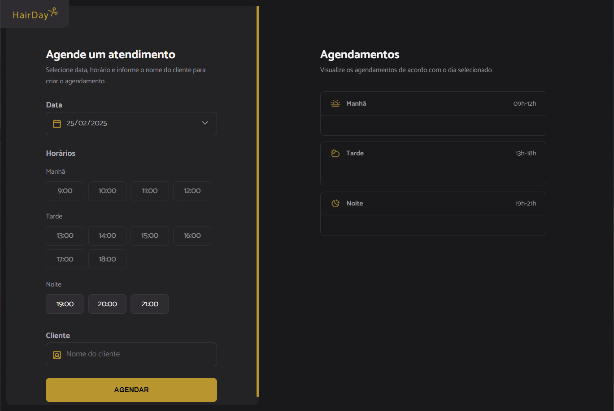

# Hair Salon Appointment Maker

This project is an **hair salon appointment simulator** built with **HTML, CSS, JavaScript, Webpack, Babel and HTTP API**. It allows users to make appointments. This is a [Rocketseat](https://www.rocketseat.com.br/?utm_source=google&utm_medium=cpc&utm_campaign=lead&utm_term=perpetuo&utm_content=institucional-lead-home-texto-lead-brandkws-none-none-institucional-none-none-br-google&gad_source=1&gclid=CjwKCAiAtYy9BhBcEiwANWQQL_7PJhNk7vjUU2WS5edbdA0Q-JW-9ytiEHPkbCOhkU4Y2gnl6gjFZxoCVxgQAvD_BwE) study project.

## 📸  

## 🚀 Stack  

### 🔹 JavaScript  
- **Text methods** – String manipulation for currency formatting.  
- **DOM manipulation** – Selecting, creating, and modifying DOM elements. 
- **Form interaction** – Captures and handles form events (`onsubmit`, `oninput`).  
- **CSS elements manipulation** – Dynamically modifies element classes and styles.  

### Webpack
- **Configuration** - Custom setup to bundle files, enabling efficient asset loading and hot module replacement during development.

### API
- **JSON Server** - Simulates a backend to store appointment data, allowing the app to function as if it were connected to a real API.

### 🎨 CSS  
- **Responsive design** – Supports various screen sizes using media queries.  
- **Custom input and button styling** – Well-styled form elements, buttons, and scrollbar.  

### 📄 HTML  
- **Semantic structure** – Uses proper tags for accessibility and content organization.  
- **Interactive forms** – Input fields for amount and currency.  

### 🛠 Features
- **Appointment scheduling** - Users can select the date, time and submit an appointment.
- **Dynamic appointment list** - The app displays a list of all scheduled appointments
- **Input validation** - Ensures all fields are properly filled out before submission.